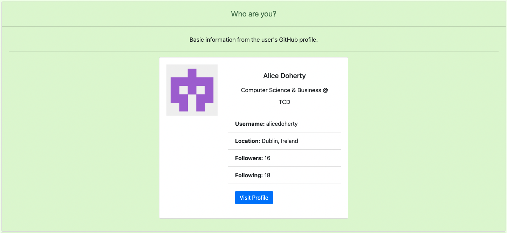
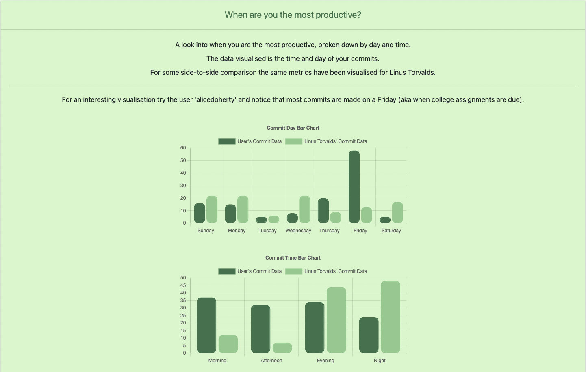
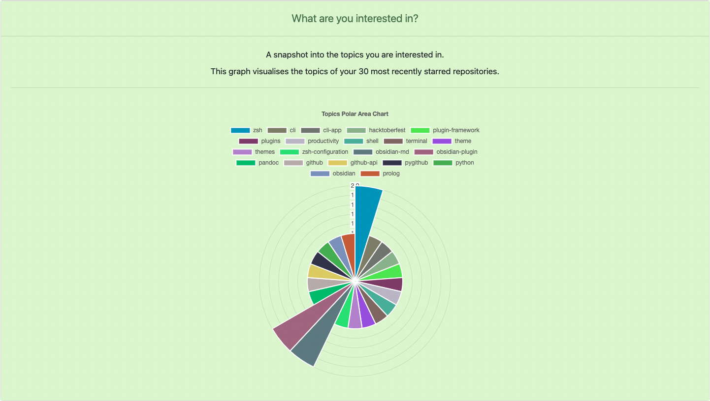
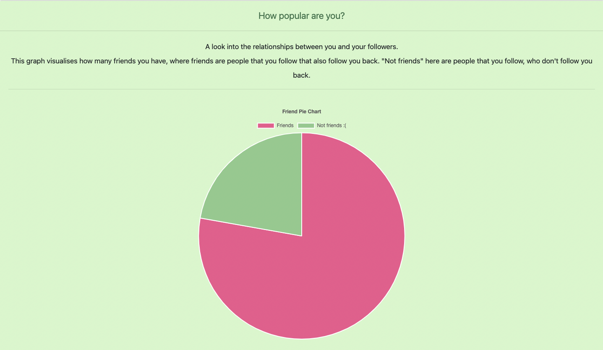
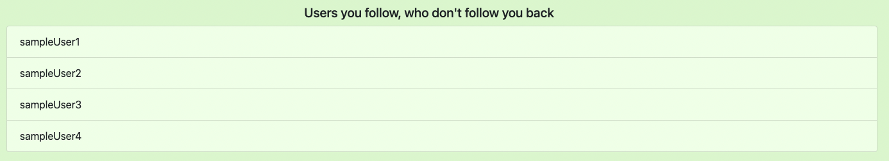
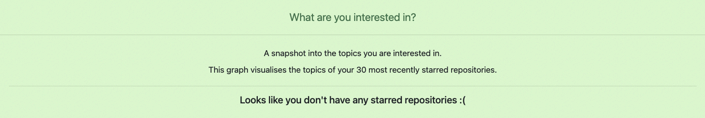
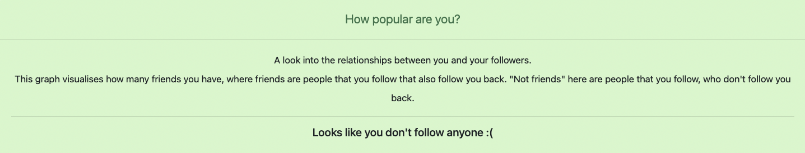

# github-visualization

A visualisation of different aspects of the software engineering process.

The GitHub API is interrogated and the data is visualised using Chart.js.

**Technologies Used:**
- HTML, CSS, and JavaScript
- [GitHub REST API](https://docs.github.com/en/rest)
- [Chart.js](https://www.chartjs.org/)
- [Bootstrap](https://getbootstrap.com/)

## How to run

### Online [RECOMMENDED]
The project is hosted online with GitHub Pages and can be found at: https://alicedoherty.github.io/github-visualization/

### Locally
1. Clone this repository:

`git clone https://github.com/alicedoherty/github-visualization.git`

2. Open `index.html` in your browser of choice:

Locate the cloned repository and right click `index.html`, hover over `"Open With"`, and select your preferred browser
- OR on macOS run: `open -a "Google Chrome" index.html`

## Demo
### How to use
1. Enter a valid GitHub username (and optionally an authentication token) - recommended username: 'alicedoherty'

2. Click "Visualise!"

3. Click on the questions below to view the relevant visualisations - note that some graphs may take a few seconds to render

### Who are you?
This section returns basic information about a user's GitHub profile and a link to their profile.

This is mainly to demonstrate the retrieval of basic data and to show which user's data is being analysed.

### When are you the most productive?
This section contains two graphs. One which breaks down a user's commit history by day, and another by time.

The times are defined as follows:
- Morning = 5am - 12pm
- Afternoon = 12pm - 5pm 
- Evening = 5pm - 9pm
- Night = 9pm - 5am

For interesting comparison, I have also visualised the same metrics for Linus Torvalds (torvalds).

The aim of this section is to give the user an insight into when they get the most work done. For example, for my profile (alicedoherty), an overwhelming majority of my commits are made on Fridays (because this is when most assignments are due).

### What are you interested in?
This section visualises what topics you are most interested in by looking at the topics of your starred repositories.

### How popular are you?
This section looks at the relationships between you and your followers.

It defines friends as those users who you follow, who also follow you back (this is how TikTok defines friends). "Not friends" are those who you follow, who don't follow you back.

It also lists the users you follow, who don't follow you back. (Note: that for this demo I have changed the usernames to sample ones, but if you were to run the program yourself the actual usernames would be displayed).

### Error handling

When you don't have any starred repositories:

When you don't follow anyone:

## Limitations
- The data is not stored in a database, so at times, depending on the user, there may be a few seconds before the graph is rendered.
- The analysis is limited to the last 30 commits to a repository, and the last 30 starred repositories for a user in order to prevent major delays when collecting the data.
- The choice to not use a database was due to time constraints.